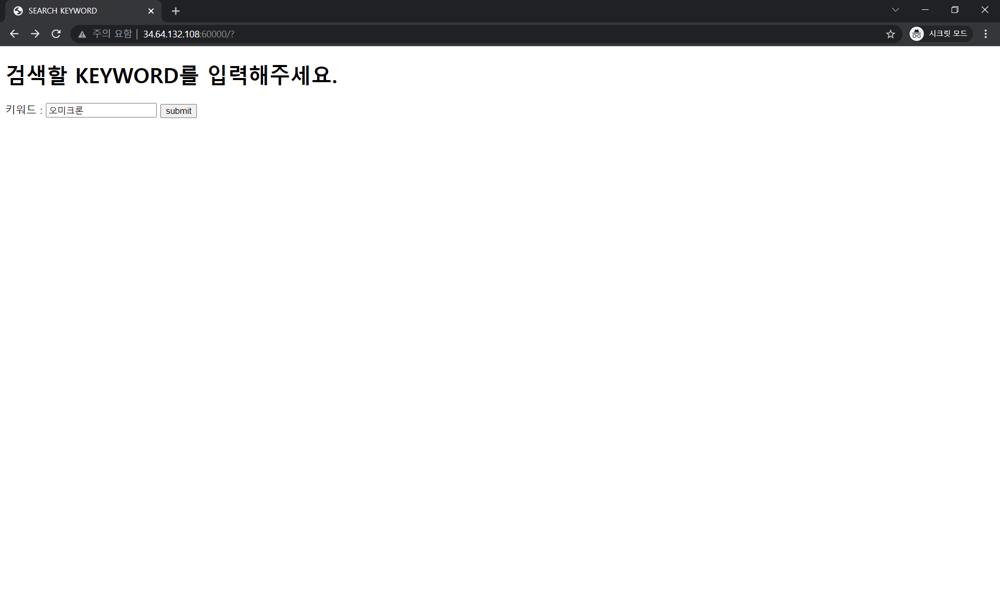
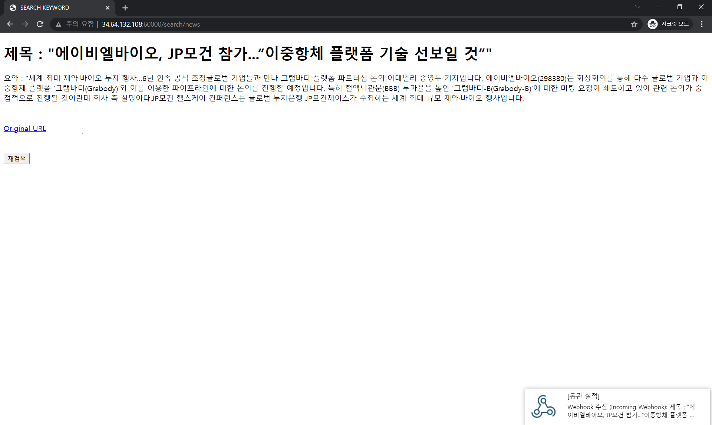
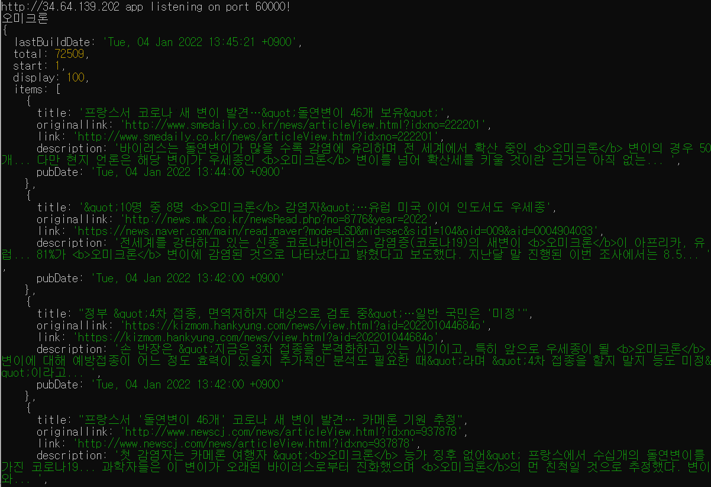
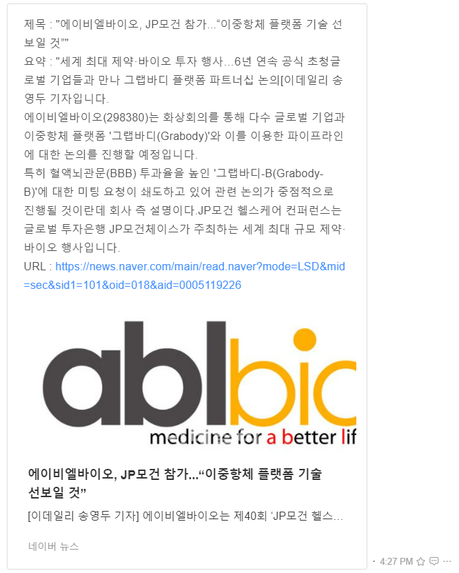

 

# NAVER API PRACTICE
## Outline
**NAVER의 OPEN API 중 검색을 원하는 문자열을 통해 제목, 링크, 요약 등의 결과를 알려주는 SEARCH API 와 2,000자 미만의 본문을 3문장 이내로 요약해주는 CLOVA SUMMARY API를 사용하여 Node.js의 Express 프레임워크를 이용해서 GCP(Google Cloud Platform)를 통해 만든 웹서버에 출력해주고, Jandi의 Webhook 서비스를 통해서 해당 내용을 메시지로 전송하는 기능입니다.**
## Description
  
> **1. 메인 홈페이지 생성**
> 
> 
> - **Keyword를 입력받을 메인 홈페이지를 View Engine인 ejs를 통해 생성**
> ```javascript
> app.set('view engine','ejs');
> app.get('/',(req,res)=>{res.render('homepage.ejs');});
> ```
> - **입력받은 Keyword를 /search/news 로 전송**
> ```ejs
> <!DOCTYPE html>
> <html>
> <head>
>     <meta charset="utf-8" />
>     <title>SEARCH KEYWORD</title>
> </head>
> <body>
>     <h1>검색할 KEYWORD를 입력해주세요.</h1>
>     <form action='/search/news' method='POST'>
>         키워드 : <input type='text' name="name">
>         <input type='submit' value="submit">
>     </form>
> </body>
> </html>
> ```
> **2. 원하는 Keyword를 검색 후 내용 출력**
>
> 
> **코드**
> <details markdown="1">
> <summary></summary>
>
> ```javascript
> app.post(`/search/news`, (req, res) => {
>     // 메인 홈페이지에서 받은 Keyword인 req.body.name을 parameter로 삽입
>     const api_url = 'https://openapi.naver.com/v1/search/news?query=' + encodeURI(req.body.name) + > '&display=100';
>     const naverSearchOptions = {
>         url: api_url,
>         headers: {'X-Naver-Client-Id':client_id, 'X-Naver-Client-Secret': client_secret},
>         method : 'GET'
>     };
>     request(naverSearchOptions, function (error, response, body) {
>         if (!error && response.statusCode == 200) {
>             const newBody = JSON.parse(body);
> 
>             // 네이버 뉴스만 추출
>             const extractUrl = _.find(newBody.items, (o) => {return o.link.indexOf("https://news.naver.com") > -1});
> 
>             // 올바르지 않은 검색어일 경우를 처리
>             if (extractUrl == undefined) {
>                 return res.render('notfound.ejs');
>             };
>             
>             // request 변수 선언
>             const newLink = {
>                 url: extractUrl.link,
>                 // charset 이 euc-kr일 경우 binary로 encoding 해야함.
>                 encoding: "binary",
>                 method : 'GET'
>             };
>             request(newLink, (error, response, html) => {
>                 // charset 이 euc-kr일 경우
>                 if (charset(html) == "euc-kr") {
>                     euckrCheerio(html);
>                 // charset이 utf-8일 경우 
>                 } else {
>                     delete newLink.encoding;
>                     request(newLink, (error, response, html) => {    
>                         utf8Cheerio(html);
>                     });
>                 };
>                 // Promise 방식으로 request.post
>                 doRequest(requestConfig).then((resp) => {
>                     console.log("doRequest func works!");
>                     res.render('search', {
>                         'title' : `${articleTitle}`,
>                         'summary' : `${resp.body.summary}`,
>                         'url' : `${extractUrl.link}`
>                     });
>                     jandiWebhook(articleTitle, resp.body.summary, extractUrl.link);
>                 // error 처리할 때 catch 문 활용할 것
>                 }).catch((err) => {
>                     console.log("doRequest func do not work.");
>                     console.log(error);
>                     res.render('fail', {
>                         'url' : `${extractUrl.link}`
>                     });
>                 });
>             });
>         } else {
>             res.render('null.ejs');
>             console.log('error = ' + response.statusCode);
>         };
>     });
> });
> ```
>
> </details>
>
> - 메인 홈페이지에서 받은 Keyword를 SEARCH API를 사용할 때 필요한 parameter에 삽입을 하면 해당 Keyword가 들어간 뉴스를 출력
>
> 
>
> - 출력해준 결과에서 본문 내용 전체가 보이지 않으므로 해당 링크에서 CSS Seletor로 기사 본문만 추출하는 방법을 이용
> 
> - Naver의 기사가 아닌 다른 URL의 기사들은 HTML Tag가 통일되지 않아서 Naver의 기사만 추출할 수 있도록 lodash module을 사용
>
> - Naver의 기사 중에서도 연예 관련 뉴스의 charset이 utf-8, 나머지는 euc-kr이므로 조건문으로 나눠서 실행
>
> - 추출한 각 기사의 본문 내용을 CLOVA SUMMARY API를 사용할 때 필요한 body에 삽입
>
> - 요약된 기사를 출력 후, Webhook 서비스를 통해 Jandi로 메시지 전송
>
> 3. **Jandi로 메시지 전송**
>
> 