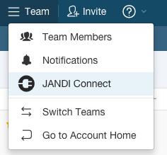
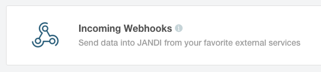
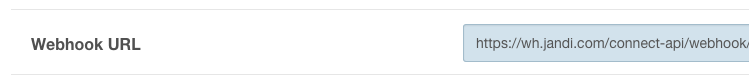
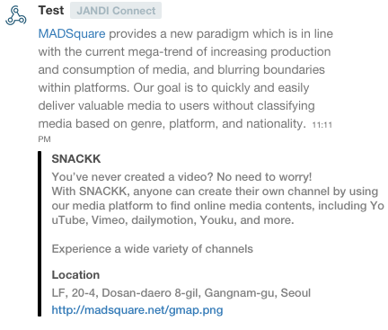

# jandi

[Jandi](http://jandi.com) Node SDK for webhook.

[ ](https://www.npmjs.com/package/jandi)

[](https://github.com/feross/standard)

## Install

```
npm install jandi
```

## Jandi Webhook Usage

At first, you have to apply and copy `webhook url`








## Webhook usage

```javascript
var Jandi = require('jandi')

var jandi = new Jandi()
jandi.setWebhook(__webhookURL__)

jandi.webhook({
  body: '[MADSquare](http://madsquare.net) provides a new paradigm which is in line with the current mega-trend of increasing production and consumption of media, and blurring boundaries within platforms. Our goal is to quickly and easily deliver valuable media to users without classifying media based on genre, platform, and nationality.',
  connect: {
    color: '#000000',
    info: [
      {
        title: 'SNACKK',
        description: [
          'You’ve never created a video? No need to worry!',
          'With SNACKK, anyone can create their own channel by using our media platform to find online media contents, including YouTube, Vimeo, dailymotion, Youku, and more.',
          '',
          'Experience a wide variety of channels'
        ].join('\n')
      },
      {
        title: 'Location',
        description: 'LF, 20-4, Dosan-daero 8-gil, Gangnam-gu, Seoul ',
        imageUrl: 'http://madsquare.net/gmap.png'
      }
    ]
  }
}, function (err) {
  console.error(err)
})

```

## Result




## LICENSE

jandi is licensed under the MIT license.
